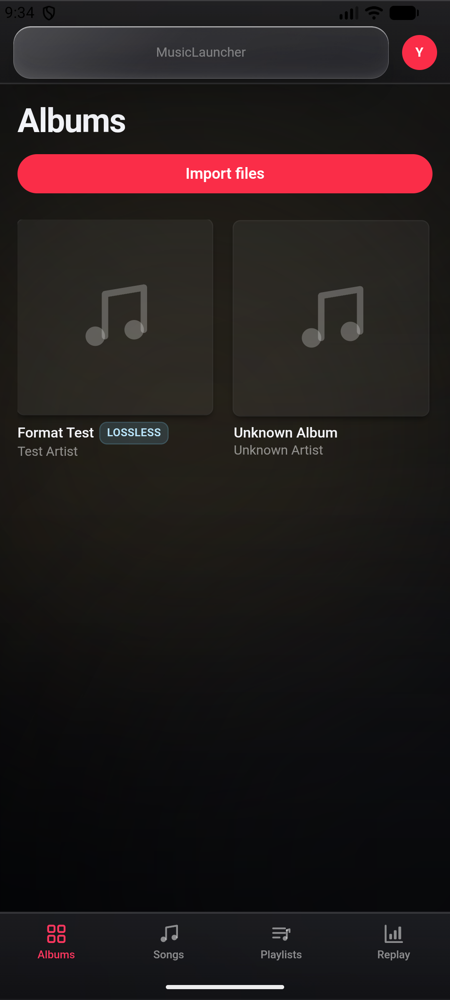

<div align="center">

# MusicLauncher

**A cross-platform, lossless music player for the Web and Android.**

<p>
  
  
  
  
</p>

MusicLauncher blends the liquid-glass aesthetics and lossless audio of Apple Music with the hyper-personalized stats of Spotify Wrapped — from a single codebase deployed to the Web and Android.



</div>

---

## Table of Contents

- [Features](#features)
- [Getting Started](#getting-started)
  - [Local Development](#local-development)
  - [Cloud Sync Setup](#cloud-sync-setup)
  - [Deployment](#deployment)
- [Project Structure](#project-structure)
- [Tech Stack](#tech-stack)
- [Known Limitations](#known-limitations)

## Features

- **Liquid-Glass UI** — Immersive, frosted `backdrop-filter` panels with an ambient glow that extracts colors from the current album art and animates smoothly on track changes.
- **Lossless & Hi-Res Audio** — Native FLAC/WAV playback. ALAC (`.m4a`) is fully decoded in JavaScript to lossless PCM. A Hi-Res badge appears automatically based on real file metadata (>16-bit or >48 kHz).
- **Cross-Platform** — Deploy as a Vercel web app or a native Tauri Android application from the exact same codebase.
- **Cloud Library Sync** — Sync your music across devices via Supabase. Files are stored in a private bucket and kept in sync with Supabase Realtime.
- **Gapless Playback & Crossfade** — Seamless auto-advance powered by a preloading dual-audio-element engine, with configurable crossfade (3 s / 6 s / 12 s / off).
- **Live Wrapped Stats** — Every listen is logged. Your "Wrapped" page continuously updates your top songs, top artists, and total listening time.
- **Synchronized Lyrics** — Parses embedded lyrics (ID3 SYLT, USLT / Vorbis comments). Synced lines auto-scroll and highlight karaoke-style; tap any line to seek to that moment.

## Getting Started

### Prerequisites

- [Node.js](https://nodejs.org/) 18+
- (Android builds only) [Rust](https://rustup.rs/) and the [Tauri Android toolchain](https://tauri.app/start/prerequisites/)

### Local Development

```bash
# 1. Install dependencies
npm install

# 2. Start the dev server
npm run dev
```

The app opens at `http://localhost:5175`.

> **No music on hand?** Click **Load demo tracks** on the welcome screen — the app synthesizes real lossless WAV tones in the browser so you can test the player immediately.

### Cloud Sync Setup

1. Create a new [Supabase](https://supabase.com/) project.
2. Run the migration in the SQL editor: [`supabase/migrations/20260711_music_sync.sql`](supabase/migrations/20260711_music_sync.sql).
3. Copy `.env.example` to `.env.local` and fill in your Supabase project URL and anon key.
4. Set the Supabase Auth redirect URLs to your deployment domain.

### Deployment

**Web (Vercel)**

Import the repository into Vercel — the included `vercel.json` handles SPA routing automatically.

**Android (Tauri)**

```bash
npm run tauri android init        # One-time setup
npm run android:dev               # Run on a connected device/emulator
npm run android:build             # Build a standalone APK (arm64)
npm run android:build:universal   # Universal APK (32-bit / emulator support)
```

## Project Structure

| Directory | Purpose |
| :--- | :--- |
| `src/components/` | React UI components (player controls, glass layouts, badges) |
| `src/pages/` | Application views (Library, Wrapped, Now Playing) |
| `src/store/` | Zustand state management (`player.ts`) |
| `src/audio/` | Core audio engine (gapless logic, ALAC decoding) |
| `src/lib/` | Helpers (metadata parsing, colors, IndexedDB, cloud sync) |
| `src-tauri/` | Rust-based Tauri backend for Android and desktop builds |
| `supabase/` | Database migrations for cloud sync |

## Tech Stack

| Layer | Technology |
| :--- | :--- |
| Frontend | React 18, Tailwind CSS, Framer Motion |
| State | Zustand |
| Audio | Web Audio API, `music-metadata`, `@audio/decode-aac` |
| Backend & DB | Supabase (Auth, Postgres, Storage, Realtime) |
| Native shell | Tauri 2 (Android) |

## Known Limitations

- ALAC decoding is front-loaded into memory, so very large ALAC tracks may pause briefly before first playback.
- Demo track imports use in-memory blob URLs and reset on page reload. (Real folder imports persist via File System Access API handles.)

---

<div align="center">
  <i>Built for the love of high-fidelity music.</i>
</div>
